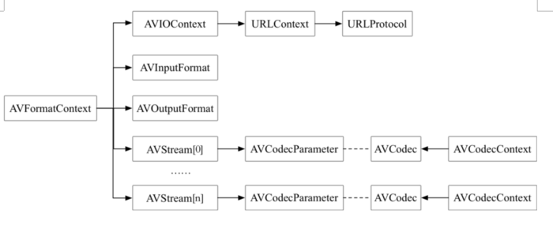

转载原文地址：https://blog.csdn.net/m0_37236246/article/details/78983053

# ffmpeg简析

### 1. 项目结构
- libavformat 
    用于音视频封装格式的生成和解析，包括解码所需信息，读取音视频数据，流媒体协议，音视频格式的解复用/复用

- libavcodec 

    音视频各种格式的编解码

- libavutil 
    公共的工具函数的使用库，包括算数运算，字符操作

- libswscale 
    提供原始视频的比例缩放、色彩映射转换、图像颜色空间或格式转换的功能

- libswresample 
    提供音频重采样，采样格式转换和混合等功能

- libavfilter 
    各种音视频滤波器

- libpostproc 
    用于后期效果处理，如图像的去块效应等

- libavdevice 
    用于硬件的音视频采集、加速和显示

### 2. 常用结构

##### 2.1 封装格式

- AVFormatContext 
描述了媒体文件的构成及基本信息，是统领全局的基本结构体，贯穿程序始终，很多函数都要用它作为参数；

- AVInputFormat 
 解复用器对象，每种作为输入的封装格式(例如FLV、MP4、TS等)对应一个该结构体，如libavformat/flvdec.c的ff_flv_demuxer；

- AVOutputFormat 
复用器对象，每种作为输出的封装格式（例如FLV, MP4、TS等）对应一个该结构体，如libavformat/flvenc.c的ff_flv_muxer；

- AVStream 
用于描述一个视频/音频流的相关数据信息

##### 2.2 解编码

- AVCodecContext 
描述编解码器上下文的数据结构，包含了众多编解码器需要的参数信息；

- AVCodec 
编解码器对象，每种编解码格式(例如H.264、AAC等）对应一个该结构体，如libavcodec/aacdec.c的ff_aac_decoder。每个AVCodecContext中含有一个AVCodec；

- AVCodecParameters 
编解码参数，每个AVStream中都含有一个AVCodecParameters，用来存放当前流的编解码参数。

##### 2.3 网络协议

- AVIOContext 
管理输入输出数据的结构体

- URLProtocol 
描述了音视频数据传输所使用的协议，每种传输协议(例如HTTP、RTMP)等，都会对应一个URLProtocol结构，如libavformat/http.c中的ff_http_protocol

- URLContext 
封装了协议对象及协议操作对象。

##### 2.4 数据存放

- AVPacket 
存放编码后、解码前的压缩数据，即ES数据

- AVFrame 
存放编码前、解码后的原始数据，如YUV格式的视频数据或PCM格式的音频数据等

##### 2.5 结构体关系图

